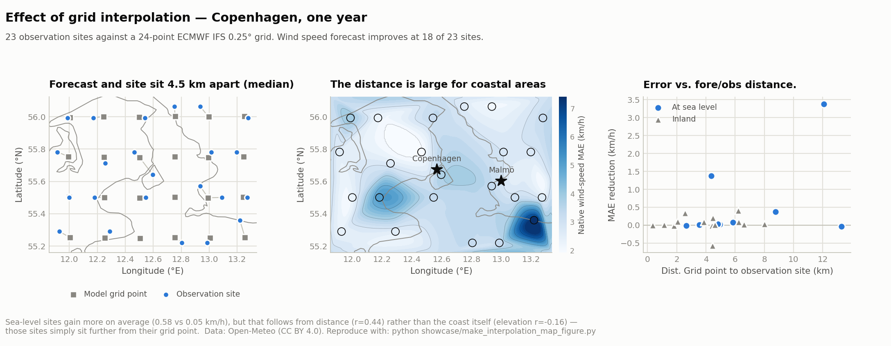
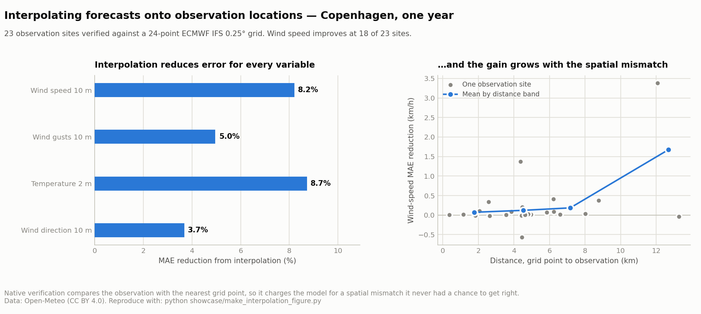
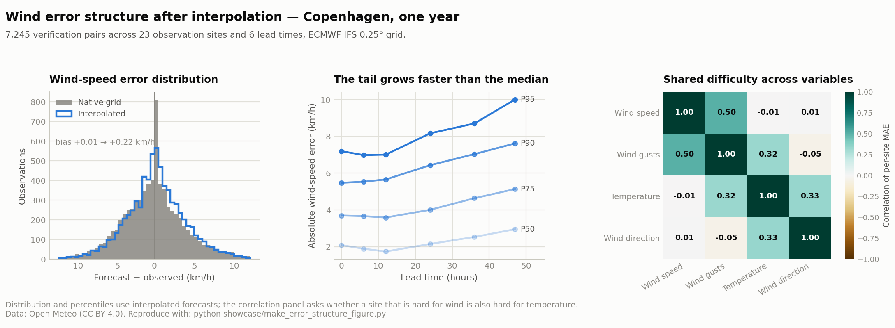
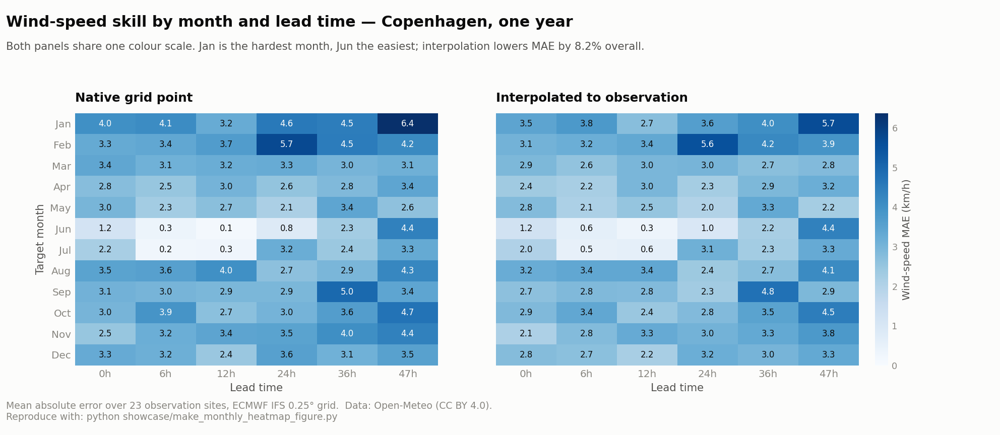
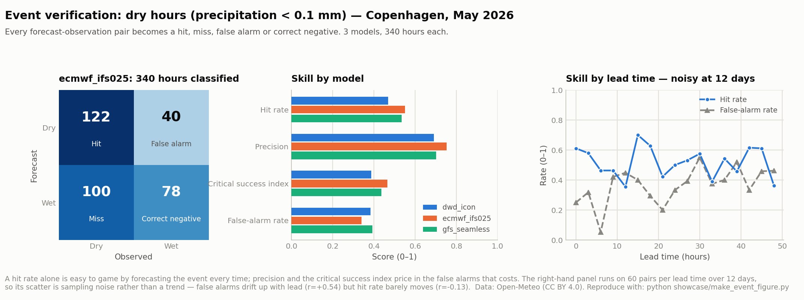
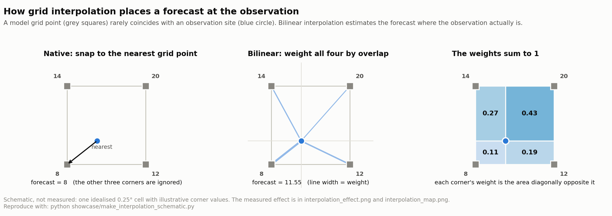
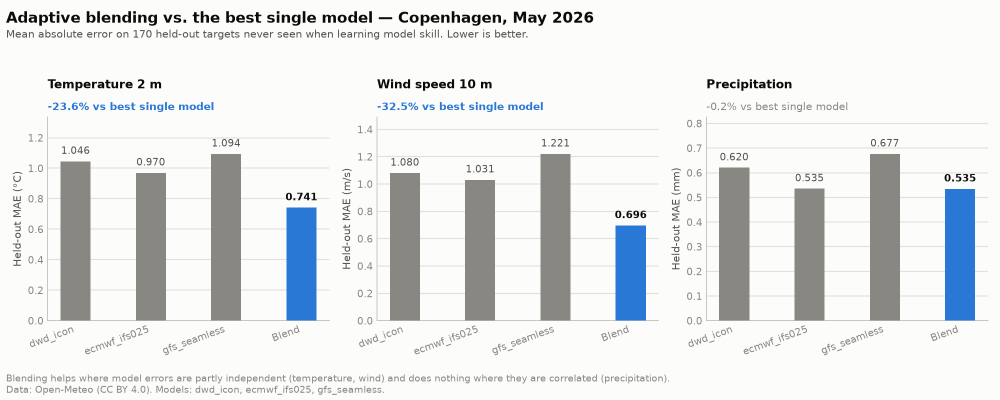

# MeteoRight

A small weather analysis laboratory built on Open-Meteo.

MeteoRight helps you ask a weather question, pull historical forecasts and
observations into local files, and get to analyzing quickly. It is
focused on forecast evolution, lead-time degradation, grid verification and interpolation, event
skill, and model comparison.

It is not a forecasting model or a general weather API wrapper. It is a
practical workspace for investigating how forecast accuracy depends on lead time, using Open Meteo's open API.

## Why This Exists

Forecasts are most useful when you can ask specific questions:

- How did the forecast evolve before a storm?
- Which lead times were still useful?
- Were forecast misses caused by timing, spatial mismatch, or model bias?
- Did a predicted rain or frost event actually happen?
- Do the same locations fail across multiple variables?

Open-Meteo makes the raw forecast and observation data accessible. This project
turns that access into local analysis tables, verification metrics, and curated
figures that make iteration fast.

The goal is simple: ask a weather question, get to a plot with verified data quickly.

## Showcase

The `showcase/` folder contains the curated figures to showcase what can be achieved by a single CLI command.

A cornerstone of the MeteoRight analysis scheme is grid interpolation. A forecast
lives at a model grid point; an observation lives wherever the station is. Comparing
them directly charges the model for a spatial mismatch it never had a chance to get
right, so `meteoright verify --interpolate bilinear` estimates the forecast *at the
observation location* before computing any error.

Around Copenhagen the two sit a median 4.5 km apart, and interpolation changes the
answer most where that gap is widest — not uniformly across the map.


Measured over a year at 23 sites around Copenhagen against a 24-point ECMWF IFS
0.25° grid, this removes 8.2% of wind-speed error and 8.7% of temperature error —
and the gain grows with the distance between grid point and station, which is
exactly the error it is meant to remove.



Error grows with lead time, but not evenly: the tail grows faster than the
median, so the typical forecast degrades far more slowly than the worst one. The
same view also asks whether a location that is hard for wind is hard for
temperature — here it is not.


To answer questions like ***are some months simply harder to forecast?*** the
same errors can be laid out by month and lead time. January is the hardest month
for wind around Copenhagen and June the easiest, and interpolation lifts the
whole surface rather than any single cell.


Event-based verification turns weather questions into yes/no outcomes: forecast
rain, observed rain, missed event, false alarm.



The geometry behind `--interpolate` is worth seeing on its own: a model grid
point rarely lands on the observation, and bilinear weighting places the
forecast where the measurement actually is.


While Copenhagen was chosen as a demo area, the methodology can be applied anywhere on the globe.

## What You Can Do

- Download observations and archived forecast runs from Open-Meteo.
- Preserve forecast issue time, target time, model, location, and lead time.
- Compare forecasts with observed weather.
- Measure MAE, RMSE, bias, event skill, and lead-time degradation.
- Study forecast evolution before specific events.
- Run local grid investigations around a city or point of interest.
- Compare native grid verification with interpolated verification.
- Build reproducible weather investigations from local Parquet data.

## Open-Meteo Backend

MeteoRight works with the public Open-Meteo APIs by default. That is the easiest
way to try the project: no local backend is required for non-commercial use. This method is however, strongly rate-limited.

For larger investigations, the fast path is a local Open-Meteo backend. The
upstream server is open source at
[open-meteo/open-meteo](https://github.com/open-meteo/open-meteo), and their
README links to Docker-based self-hosting instructions. Once your local server
is running, point MeteoRight at it:

```bash
export METEORIGHT_OPEN_METEO_BASE_URL="http://localhost:8080"
```

You can also pass the backend directly to a download command:

```bash
meteoright download \
  --lat 55.605 --lon 12.574 \
  --start 2026-05-20 --end 2026-05-22 \
  --type observations \
  --variables temperature_2m,precipitation,wind_speed_10m \
  --open-meteo-base-url http://localhost:8080 \
  --output data/copenhagen_demo
```

Commercial Open-Meteo users are can use their API key from the
[Open-Meteo pricing page](https://open-meteo.com/en/pricing). MeteoRight sends
that key as the Open-Meteo `apikey` query parameter:

```bash
export METEORIGHT_OPEN_METEO_API_KEY="your-key"
```

Endpoint overrides are available when a hosted or self-hosted deployment uses
separate domains:

```bash
export METEORIGHT_OPEN_METEO_ARCHIVE_API="https://archive-api.open-meteo.com/v1/archive"
export METEORIGHT_OPEN_METEO_SINGLE_RUNS_API="https://single-runs-api.open-meteo.com/v1/forecast"
export METEORIGHT_OPEN_METEO_PREVIOUS_RUNS_API="https://previous-runs-api.open-meteo.com/v1/forecast"
export METEORIGHT_OPEN_METEO_HISTORICAL_FORECAST_API="https://historical-forecast-api.open-meteo.com/v1/forecast"
```

## Quick Start

Requires Python 3.11+.

```bash
git clone <repo-url>
cd meteoright

python -m venv .venv
source .venv/bin/activate
pip install -e ".[dev]"
```

Download a small Copenhagen example:

```bash
meteoright download \
  --lat 55.605 --lon 12.574 \
  --start 2026-05-20 --end 2026-05-22 \
  --type observations \
  --variables temperature_2m,precipitation,wind_speed_10m \
  --output data/copenhagen_demo

meteoright download \
  --lat 55.605 --lon 12.574 \
  --start 2026-05-20 --end 2026-05-22 \
  --type forecast \
  --model ecmwf_ifs_single \
  --variables temperature_2m,precipitation,wind_speed_10m \
  --output data/copenhagen_demo
```

Build verification rows and first metrics:

```bash
meteoright verify \
  --data-dir data/copenhagen_demo \
  --variables temperature_2m,precipitation,wind_speed_10m \
  --output data/copenhagen_demo/verification

meteoright metrics \
  --verification "data/copenhagen_demo/verification/*.parquet" \
  --group-by lead_hours,model \
  --variables temperature_2m,precipitation,wind_speed_10m \
  --output data/copenhagen_demo/metrics
```

Create the first figures:

```bash
meteoright analyze \
  --metrics "data/copenhagen_demo/metrics/*.parquet" \
  --verification "data/copenhagen_demo/verification/*.parquet" \
  --variables temperature_2m,precipitation,wind_speed_10m \
  --plots lead_time,distributions \
  --generate-tables \
  --output data/copenhagen_demo/analysis
```

This writes lead-time plots, error-distribution plots, and small CSV summary
tables under `data/copenhagen_demo/analysis/`.

For grid-based investigations around a location:

```bash
meteoright grid-points \
  --lat 55.605 --lon 12.574 \
  --radius-km 50 \
  --summary
```

Then open `showcase/README.md` for examples of the analysis outputs this repo is shaped around.

## Python Examples

Fetch observations and archived forecast runs:

```python
from src.core.pipeline import download_forecast, download_historical

location = {"name": "Copenhagen", "lat": 55.605, "lon": 12.574}
variables = ("temperature_2m", "precipitation", "wind_speed_10m")

download_historical(location, "2026-05-20", "2026-05-22", variables, "data/copenhagen_demo")
download_forecast(
    location,
    "2026-05-20",
    "2026-05-22",
    variables,
    ["ecmwf_ifs_single"],
    "data/copenhagen_demo",
)
```

Align forecasts with observations and calculate lead-time error:

```python
from pathlib import Path

from src.historical.verification.aligner import align_forecasts_with_observations
from src.historical.verification.loaders import load_forecasts, load_observations

data_dir = Path("data/copenhagen_demo")
variables = ("temperature_2m", "wind_speed_10m")

forecast = load_forecasts(data_dir, "ecmwf_ifs_single", "2026-05-20", "2026-05-22")
truth = load_observations(data_dir, "2026-05-20", "2026-05-22")
aligned = align_forecasts_with_observations(forecast, truth, variables)

aligned["temperature_error"] = (
    aligned["forecast_temperature_2m"] - aligned["observed_temperature_2m"]
)
mae_by_lead = aligned.groupby("lead_hours")["temperature_error"].apply(lambda s: s.abs().mean())
print(mae_by_lead.head())
```

Use a local Open-Meteo backend directly:

```python
from src.forecast.fetch import fetch_forecast

data = fetch_forecast(
    55.605,
    12.574,
    models=["ecmwf_ifs_hres"],
    hourly=["temperature_2m", "wind_speed_10m"],
    past_days=2,
)
```

## Example Investigations

- **Forecast evolution**: inspect how forecasts for the same event changed
  across issue times.
- **Lead-time degradation**: measure where forecast skill starts to decay.
- **Grid interpolation**: compare native grid-point verification with forecasts
  interpolated onto observation points.
- **Rain and frost events**: ask whether predicted threshold events actually
  happened.
- **Wind reliability**: compare wind speed, gust, and direction error by lead
  window.
- **Spatial error structure**: find whether hard locations are shared across
  variables.
- **Model comparison**: compare model behavior on shared targets rather than
  isolated downloads.
- **Adaptive blending**: combine models by historical skill and measure whether
  the blend beats the best single model.

## Adaptive Model Blending

Comparing models answers *which one is best*. Blending asks a different
question: *can several mediocre models beat the best single one?* When model
errors are partly independent, a skill-weighted average cancels some of that
error out.

`meteoright blend` learns each model's skill on a training split, weights the
models accordingly, then blends and scores the **held-out** rows — so the
weights are never informed by the observations they are judged against:

A verification sample is bundled with the repo, so this runs on a fresh clone
with no downloads and no API key:

```bash
meteoright blend \
  --verification examples/copenhagen_sample/verification/verification.parquet \
  --variable temperature_2m
```

```text
  340 shared targets across 3 models: dwd_icon, ecmwf_ifs025, gfs_seamless
    dwd_icon                 train MAE = 1.020
    ecmwf_ifs025             train MAE = 0.903
    gfs_seamless             train MAE = 1.070
──────────────────────────── Weights ─────────────────────────────
  ecmwf_ifs025   0.791   strong historical skill (score=1.00); stable forecasts
  dwd_icon       0.209   strong historical skill (score=0.89); stable forecasts
  gfs_seamless   0.000   strong historical skill (score=0.84); stable forecasts
──────────────────────── Held-out evaluation ─────────────────────
  Blended MAE      : 0.7414
  Best single MAE  : 0.9700 (ecmwf_ifs025)
  Blending helped: 23.6% lower error
  Evaluated on 170 held-out targets
```



Blending helps where model errors are partly independent, and does nothing
where they are correlated. Temperature and wind gain 24% and 32%;
precipitation gains nothing, because when a convective shower is misplaced all
three models tend to misplace it the same way, so averaging cancels no error.
That null result is reported as plainly as the wins.

Every weight carries a plain-language rationale — there is no black box, and
no deep learning. Regenerate the figure with
`python showcase/make_blend_figure.py`.

## Project Structure

```text
meteoright/
|-- meteoright/cli/         # One module per subcommand, plus the parser and dispatch
|-- cli.py                  # Thin shim so `python cli.py` keeps working
|-- downloader/             # Open-Meteo API clients, normalization, Parquet storage
|-- historical/             # Historical download planning, storage, normalization
|-- verification/           # Forecast/observation alignment, provenance, validation
|-- metrics/                # Metric computation and aggregation
|-- analysis/               # Anomalies, extremes, degradation, seasonal patterns
|-- plots/                  # Figure generation
|-- advanced_verification/  # Event verification, confusion matrices, skill scores
|-- datasets/               # Curated dataset preparation helpers used by the CLI/tests
|-- data/                   # Loaders for analysis artifacts (generated data ignored by Git)
|-- src/
|   |-- forecast/meta_forecasting/  # Adaptive model blending and skill weighting
|   |-- forecast/verification/      # Alignment, error computation, metric aggregation
|   |-- forecast/                   # Grid points, HTTP transport, canonical records
|   |-- core/                       # High-level pipeline helpers
|   `-- config/                     # Pipeline configuration models
|-- examples/               # Bundled Copenhagen sample: verification rows and outputs
|-- showcase/               # Curated publication figures, and the script that builds them
|-- docs/images/            # Supporting README/documentation figures
`-- tests/                  # Unit and integration tests
```

## Data Model

The key invariant is forecast provenance:

```text
forecast_issue_time + forecast_target_time + model + location + variable
```

## Future Directions

- More polished forecast-evolution investigations.
- More operational event investigations.
- Probabilistic and ensemble-style verification.
- Cleaner local dashboards over the same analysis stores.


## Data Attribution

Weather data is provided by [Open-Meteo](https://open-meteo.com/) under the
[CC BY 4.0 license](https://open-meteo.com/en/license).
