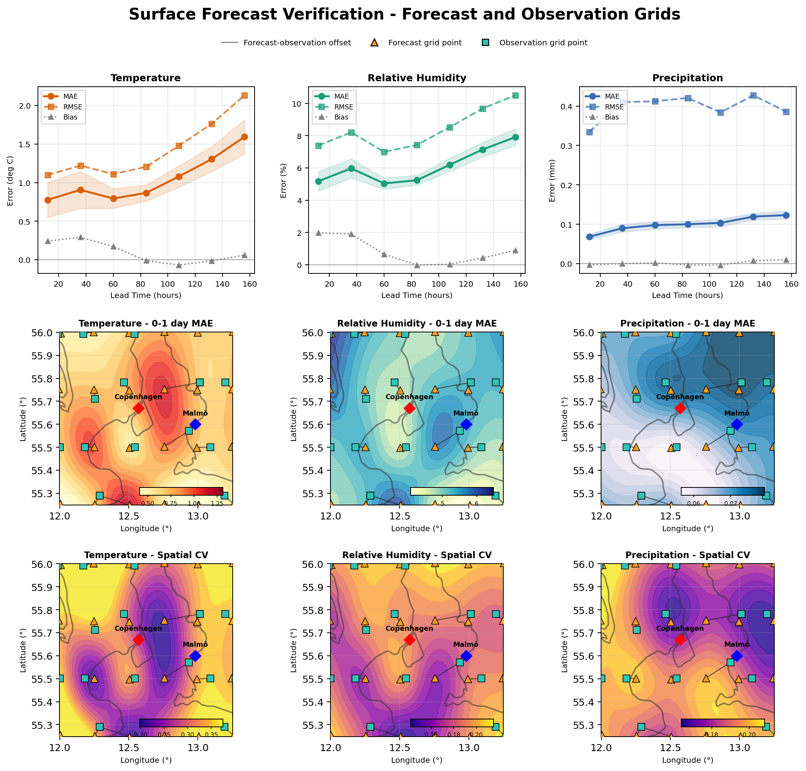

# MeteoRight

A small weather analysis laboratory built on Open-Meteo.

MeteoRight helps you ask a weather question, pull historical forecasts and
observations into local files, and get to analyzing quickly. It is
focused on forecast evolution, lead-time degradation, grid verification and interpolation, event
skill, and model comparison.

It is not a forecasting model or a general weather API wrapper. It is a
practical workspace for investigating how forecast accuracy depends on lead time, using Open Meteo's open API.

## Why This Exists

Forecasts are most useful when you can ask specific questions:

- How did the forecast evolve before a storm?
- Which lead times were still useful?
- Were forecast misses caused by timing, spatial mismatch, or model bias?
- Did a predicted rain or frost event actually happen?
- Do the same locations fail across multiple variables?

Open-Meteo makes the raw forecast and observation data accessible. This project
turns that access into local analysis tables, verification metrics, and curated
figures that make iteration fast.

The goal is simple: ask a weather question, get to a plot with verified data quickly.

## Showcase

The `showcase/` folder contains the curated figures to showcase what can be achieved by a single CLI command.

E.g., it is straightforward to generate the following plot showing the accuracy of wind-related variables in the Malmö/Copenhagen area.


A cornerstone of the MeteoRight analysis scheme is the grid interpolation, which minimizes the errors from the mismatch between the forecast and the observation grid - and the mismatch between the grids can be included in geoplots using a single CLI flag


Since most available observations are on land, whereas forecasts are everywhere, the interpolation
can have significant effects on coastal areas


Studying e.g., the mean absolute error (MAE) as a factor of lead time - averaged across an entire year - the decay in forecast accuracy with lead time is clear

and to answer questions like ***are there months which are better/worse in terms of forecast accuracy for a given variable?*** one can generate heat maps like this


Event-based verification turns weather questions into yes/no outcomes: forecast
rain, observed rain, missed event, false alarm.


While Copenhagen was chosen as a demo area, the methodology can be applied anywhere on the globe.

## What You Can Do

- Download observations and archived forecast runs from Open-Meteo.
- Preserve forecast issue time, target time, model, location, and lead time.
- Compare forecasts with observed weather.
- Measure MAE, RMSE, bias, event skill, and lead-time degradation.
- Study forecast evolution before specific events.
- Run local grid investigations around a city or point of interest.
- Compare native grid verification with interpolated verification.
- Build reproducible weather investigations from local Parquet data.

## Open-Meteo Backend

MeteoRight works with the public Open-Meteo APIs by default. That is the easiest
way to try the project: no local backend is required for
non-commercial use. This method is however, strongly rate-limited.

For larger investigations, the fast path is a local Open-Meteo backend. The
upstream server is open source at
[open-meteo/open-meteo](https://github.com/open-meteo/open-meteo), and their
README links to Docker-based self-hosting instructions. Once your local server
is running, point MeteoRight at it:

```bash
export METEORIGHT_OPEN_METEO_BASE_URL="http://localhost:8080"
```

You can also pass the backend directly to a download command:

```bash
meteoright download \
  --lat 55.605 --lon 12.574 \
  --start 2026-05-20 --end 2026-05-22 \
  --type observations \
  --variables temperature_2m,precipitation,wind_speed_10m \
  --open-meteo-base-url http://localhost:8080 \
  --output data/copenhagen_demo
```

Commercial Open-Meteo users are can use their API key from the
[Open-Meteo pricing page](https://open-meteo.com/en/pricing). MeteoRight sends
that key as the Open-Meteo `apikey` query parameter:

```bash
export METEORIGHT_OPEN_METEO_API_KEY="your-key"
```

Endpoint overrides are available when a hosted or self-hosted deployment uses
separate domains:

```bash
export METEORIGHT_OPEN_METEO_ARCHIVE_API="https://archive-api.open-meteo.com/v1/archive"
export METEORIGHT_OPEN_METEO_SINGLE_RUNS_API="https://single-runs-api.open-meteo.com/v1/forecast"
export METEORIGHT_OPEN_METEO_PREVIOUS_RUNS_API="https://previous-runs-api.open-meteo.com/v1/forecast"
export METEORIGHT_OPEN_METEO_HISTORICAL_FORECAST_API="https://historical-forecast-api.open-meteo.com/v1/forecast"
```

## Quick Start

Requires Python 3.11+. The recommended path uses [uv](https://docs.astral.sh/uv/):

```bash
git clone <repo-url>
cd meteoright

uv sync                      # creates .venv and installs base + dev deps
uv run meteoright --help
```

<details>
<summary>Prefer pip / a manual venv?</summary>

```bash
python -m venv .venv
source .venv/bin/activate
pip install -e ".[dev]"
```

</details>

See it work immediately, with no network and no backend, using the bundled
sample dataset:

```bash
uv run meteoright demo
```

This renders lead-time and error-distribution plots from a small pre-built
Copenhagen verification dataset into `examples/copenhagen_sample/out/`.

Then download a small Copenhagen example of your own (hits the public Open-Meteo
API by default; set `METEORIGHT_OPEN_METEO_BASE_URL` to use a self-hosted
backend — see `.env.example`):

```bash
meteoright download \
  --lat 55.605 --lon 12.574 \
  --start 2026-05-20 --end 2026-05-22 \
  --type observations \
  --variables temperature_2m,precipitation,wind_speed_10m \
  --output data/copenhagen_demo

meteoright download \
  --lat 55.605 --lon 12.574 \
  --start 2026-05-20 --end 2026-05-22 \
  --type forecast \
  --model ecmwf_ifs_single \
  --variables temperature_2m,precipitation,wind_speed_10m \
  --output data/copenhagen_demo
```

Build verification rows and first metrics:

```bash
meteoright verify \
  --data-dir data/copenhagen_demo \
  --variables temperature_2m,precipitation,wind_speed_10m \
  --output data/copenhagen_demo/verification

meteoright metrics \
  --verification "data/copenhagen_demo/verification/*.parquet" \
  --group-by lead_hours,model \
  --variables temperature_2m,precipitation,wind_speed_10m \
  --output data/copenhagen_demo/metrics
```

Create the first figures:

```bash
meteoright analyze \
  --metrics "data/copenhagen_demo/metrics/*.parquet" \
  --verification "data/copenhagen_demo/verification/*.parquet" \
  --variables temperature_2m,precipitation,wind_speed_10m \
  --plots lead_time,distributions \
  --generate-tables \
  --output data/copenhagen_demo/analysis
```

This writes lead-time plots, error-distribution plots, and small CSV summary
tables under `data/copenhagen_demo/analysis/`.

For grid-based investigations around a location:

```bash
meteoright grid-points \
  --lat 55.605 --lon 12.574 \
  --radius-km 50 \
  --summary
```

Then open `showcase/README.md` for examples of the analysis outputs this repo is shaped around.

## Python Examples

Fetch observations and an archived forecast run directly from the API client:

```python
from datetime import datetime, timezone

from downloader.api import fetch_observations, fetch_single_run

variables = ("temperature_2m", "precipitation", "wind_speed_10m")

observations = fetch_observations(
    lat=55.605, lon=12.574,
    start_date="2026-05-20", end_date="2026-05-22",
    variables=variables,
)
forecast = fetch_single_run(
    lat=55.605, lon=12.574,
    run_time=datetime(2026, 5, 20, 0, tzinfo=timezone.utc),
    variables=variables,
    model="ecmwf_ifs_single",
)
```

(The `meteoright download` CLI command wraps these and writes normalized Parquet
partitions under a data directory — see Quick Start above.)

Align forecasts with observations and calculate lead-time error:

```python
from pathlib import Path

from verification.aligner import align_forecasts_with_observations
from verification.loaders import load_forecasts, load_observations

data_dir = Path("data/copenhagen_demo")
variables = ("temperature_2m", "wind_speed_10m")

forecast = load_forecasts(data_dir, "ecmwf_ifs_single", "2026-05-20", "2026-05-22")
truth = load_observations(data_dir, "2026-05-20", "2026-05-22")
aligned = align_forecasts_with_observations(forecast, truth, variables)

aligned["temperature_error"] = (
    aligned["forecast_temperature_2m"] - aligned["observed_temperature_2m"]
)
mae_by_lead = aligned.groupby("lead_hours")["temperature_error"].apply(lambda s: s.abs().mean())
print(mae_by_lead.head())
```

Fetch a forecast through the thin `forecast.fetch` wrapper (public API by
default; set `METEORIGHT_OPEN_METEO_BASE_URL` to use a self-hosted backend):

```python
from forecast.fetch import fetch_forecast

data = fetch_forecast(
    55.605,
    12.574,
    models=["ecmwf_ifs_hres"],
    hourly=["temperature_2m", "wind_speed_10m"],
    past_days=2,
)
```

## Example Investigations

- **Forecast evolution**: inspect how forecasts for the same event changed
  across issue times.
- **Lead-time degradation**: measure where forecast skill starts to decay.
- **Grid interpolation**: compare native grid-point verification with forecasts
  interpolated onto observation points.
- **Rain and frost events**: ask whether predicted threshold events actually
  happened.
- **Wind reliability**: compare wind speed, gust, and direction error by lead
  window.
- **Spatial error structure**: find whether hard locations are shared across
  variables.
- **Model comparison**: compare model behavior on shared targets rather than
  isolated downloads.

## Project Structure

```text
meteoright/
|-- cli.py            # Command-line workflow: download, verify, metrics, analyze, demo
|-- downloader/       # Open-Meteo API client (fetch, normalize, storage, constants)
|-- forecast/         # Forecast fetch wrappers, canonical records, grid points, plotting
|-- historical/       # Historical download/planning (reuses downloader.constants)
|-- verification/     # Alignment, error columns, confusion matrices, skill scores
|-- metrics/          # Metric computation and aggregation
|-- plots/            # Lead-time, seasonal, and distribution plotting
|-- analysis/         # Anomalies, degradation, extremes, seasonal patterns
|-- datasets/         # Curated dataset preparation pipeline used by the CLI/tests
|-- config/           # Location presets, variable sets, event definitions
|-- util/             # Shared helpers (e.g. circular error for wind direction)
|-- examples/         # Bundled sample dataset for the offline `meteoright demo`
|-- showcase/         # Curated publication figures
|-- tests/            # Unit and integration tests
`-- data/             # Local generated datasets, ignored by Git
```

The LangGraph agent lives in the separate `meteoright-agent` companion project.

## Agent (separate package)

A constrained LangGraph agent answers natural-language questions
("how accurate is the temperature forecast for the Malmö-Copenhagen area?",
"which model is best?") by orchestrating these analysis tools within an explicit,
bounded graph — a whitelisted tool set, argument validation, a scope gate, and a
step cap.

It lives in the companion project **`meteoright-agent`**, which depends on this
lab and adds the LangGraph layer plus a bring-your-own LLM endpoint. It is opt-in;
the core lab above runs without it. Install `meteoright-agent` and use the
`meteoright-agent` command (`meteoright-agent chat`, `meteoright-agent agent
--trace "<question>"`, `meteoright-agent agent --graph`).

## Data Model

The key invariant is forecast provenance:

```text
forecast_issue_time + forecast_target_time + model + location + variable
```

## Future Directions

- More polished forecast-evolution investigations.
- More operational event investigations.
- Probabilistic and ensemble-style verification.
- Cleaner local dashboards over the same analysis stores.


## Data Attribution

Weather data is provided by [Open-Meteo](https://open-meteo.com/) under the
[CC BY 4.0 license](https://open-meteo.com/en/license).
