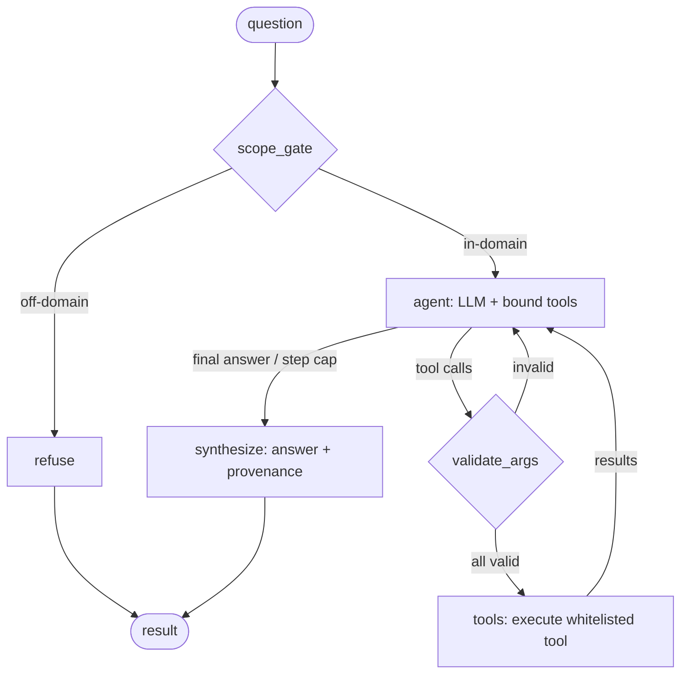

# MeteoRight Agent

A **constrained LangGraph agent** that turns a natural-language question
("how accurate is the temperature forecast for the Malmö-Copenhagen area?")
into the right MeteoRight tool calls and a synthesized answer.

The design goal is a *bounded* agent: it chooses **which** tools to call and
**what** analysis to run, but it cannot leave the graph. A whitelisted tool set,
argument validation against the data catalog, a scope gate, and a hard step cap
keep it doing only what it is supposed to.

## The graph



The **loop** is `agent → validate_args → tools → agent`. The agent keeps calling
tools (and getting results back) until it decides it has enough to answer — at
which point it emits a message with no tool calls and the graph routes to
`synthesize`. The loop is bounded by `MAX_TOOL_STEPS` (currently **6**); if the
agent is still calling tools at the cap, the graph forces `synthesize` anyway and
notes the truncation.

> The live diagram is always available with `meteoright agent --graph`
> (rendered straight from the compiled graph via `draw_mermaid()`), so it can
> never drift from the code.

### Nodes

| Node | What it does |
|------|--------------|
| `scope_gate` | A zero-temperature LLM classifier decides if the question is about forecast accuracy / model comparison / data availability. Off-domain → `refuse`. **No tools run.** |
| `refuse` | Returns a fixed message explaining what the agent can answer. Terminal. |
| `agent` | `ChatOpenAI(...).bind_tools(TOOLS)` over the message history. Either proposes tool calls or writes the final answer. |
| `validate_args` | Checks each proposed tool call against the catalog (`list_variables`, `list_models`) and metric/date rules **before** anything executes. All-or-nothing: if *any* call is invalid, none run and the agent gets a correction message to retry. |
| `tools` | A LangGraph `ToolNode` bound to exactly the whitelisted tools. Executes the validated calls and appends their JSON results. |
| `synthesize` | Collects the final answer text plus the structured tool results used, into an auditable `result` block. Terminal. |

### Edges

- `scope_gate → agent | refuse`
- `agent → validate_args` (it proposed tool calls and is under the step cap)
  **or** `agent → synthesize` (no tool calls, or step cap reached)
- `validate_args → tools` (all calls valid) **or** `validate_args → agent` (a
  correction was sent back)
- `tools → agent` (the loop)
- `refuse → END`, `synthesize → END`

## Guardrails

1. **Tool whitelist** — only these tools are exposed to the LLM:
   `forecast_accuracy`, `compare_models`, `list_variables`, `list_models`,
   `resolve_area`. Infrastructure arguments (backend URL, the cached backend
   probe, the offline-geocoding policy) are injected by closures and are **not**
   in the schema the model sees — it can only set `variable`, `area`, `model`,
   `metric`, `start`, `end`.
2. **Argument validation** (`validate_args`) — unknown variables/models/metrics
   are rejected with the list of allowed values, so the agent self-corrects
   instead of hitting a confusing backend error.
3. **Step cap** — `MAX_TOOL_STEPS` bounds the `agent ↔ tools` loop; combined with
   LangGraph's `recursion_limit` the run always terminates.
4. **Scope gate** — off-domain questions are refused before any tool runs.

## Tools the agent can call

| Tool | Purpose |
|------|---------|
| `forecast_accuracy(variable, area, model?, start?, end?)` | MAE/RMSE/bias for one model + variable over an area. |
| `compare_models(variable, area, metric?, start?, end?)` | Rank available models for a variable over an area. |
| `list_variables()` | Valid variables, which are circular, and units. |
| `list_models()` | Models available on the backend, with coverage. |
| `resolve_area(area)` | Inspect how a place/area maps to a grid point. |

These wrap the `agent_tools` package; the agent never sees the backend wiring.

## Running it

The backend container must be up (`podman start open-meteo-api`) and the LLM
endpoint reachable.

```bash
# Interactive REPL — type questions, watch each flow through the nodes:
meteoright chat

# One-shot with the node-by-node flow trace:
meteoright agent --trace "which model is best for temperature in Malmö-Copenhagen?"

# One-shot, machine-readable JSON (answer + tool calls + steps):
meteoright agent "how accurate is temperature for the Malmö-Copenhagen area?"

# Print the graph diagram (mermaid) and exit:
meteoright agent --graph
```

(Without an editable install, use `/usr/bin/python cli.py …` in place of
`meteoright …`.)

### Example flow trace

```
? which model is best for temperature in the Malmö-Copenhagen area?
  scope_gate — classified question: in-scope
  │
  ▼
  agent — proposed 1 tool call
      · compare_models(variable='temperature_2m', area='Malmö-Copenhagen')
  │
  ▼
  validate — arguments valid
  │
  ▼
  tools — executed 1 tool(s)
      · compare_models: best: dwd_icon mae=1.0525 (3 models)
  │
  ▼
  agent — produced final answer
  │
  ▼
  synthesize — synthesized final answer

✓ The best model is icon_global (1.05 °C), followed by dmi (1.11 °C)
  and ifs (1.24 °C).
```

When the agent needs more than one tool — or has to correct an invalid argument
— you will see the `agent → validate → tools → agent` block repeat, which is the
loop in action.

## LLM configuration

The model is built by `agent/llm.py` and is fully env-overridable (defaults are
the local OpenAI-compatible endpoint, no cloud key required):

| Env var | Default |
|---------|---------|
| `METEORIGHT_LLM_BASE_URL` | `http://bazzite:8080/v1` |
| `METEORIGHT_LLM_MODEL` | `qwen3.6-35b-q4-headroom` |
| `METEORIGHT_LLM_API_KEY` | `sk-noauth` (endpoint ignores it) |

Swap to a faster local model (or OpenAI) by changing these — no code change.
Each node makes a stateless HTTP call to this endpoint carrying the running
transcript; nothing is reloaded between round trips on the client side.

## Module layout

| File | Role |
|------|------|
| `llm.py` | `make_llm()` — the `ChatOpenAI` factory. |
| `tools.py` | `build_tools(backend_desc)` — whitelisted LangChain tools with infra injected. |
| `validation.py` | `validate_tool_call()` — catalog/metric/date checks. |
| `graph.py` | `AgentState`, the nodes/edges, `build_graph()`, `MAX_TOOL_STEPS`. |
| `prompts.py` | System prompt, scope-gate prompt, refusal message. |
| `run.py` | `answer(question)` (probe once → invoke graph → result) and `mermaid()`. |
| `trace.py` | `iter_flow()` / `render_flow()` — the live node-by-node flow view. |

## Tests

- `tests/test_agent_graph.py` — offline, a scripted stub LLM drives every path:
  in-scope → tool → synthesize, off-scope → refuse, invalid-arg → correction →
  retry, step-cap → truncated, plus the `iter_flow` node sequence.
- `tests/test_agent_live.py` — `@pytest.mark.network`; drives the real model +
  backend, and skips automatically when either is unreachable.

```bash
/usr/bin/python -m pytest tests/test_agent_graph.py          # offline
/usr/bin/python -m pytest -m network tests/test_agent_live.py # live
```
